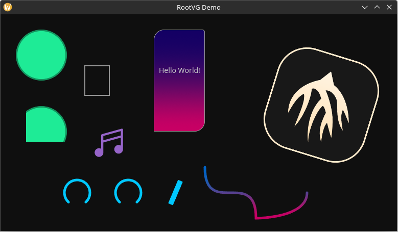

<h1> RootVG</h1>

A 2D vector graphics library optimized for GUIs, written in Rust and [wgpu](https://github.com/gfx-rs/wgpu)

## How it Works

Unlike other 2D vector graphics libraries which have a streaming drawing API similar to [HTML5's Canvas API](https://www.w3schools.com/jsref/api_canvas.asp), users of RootVG construct reusable "primitives" that can be cheaply cloned and added in any order with any z index and inside of any scissoring rectangle. Primitives of the same type, z index, and scissoring rectangle are automatically batched together so that the number of draw calls to the GPU are greatly reduced.

See the [demo](examples/demo.rs) for a quick overview of how the API works.

## Primitive Types

RootVG provides six primitive types:

* `SolidQuadPrimitive` and `GradientQuadPrimitive` - based on the quad primitives from [Iced](https://github.com/iced-rs/iced)
* `SolidMeshPrimitive` and `GradientMeshPrimitive` - draws arbitrary triangles with a solid color or a gradient. The [lyon](https://github.com/nical/lyon) crate is used to generate meshes.
* `TextPrimitive` - powered by [glyphon](https://github.com/grovesNL/glyphon/tree/main)
* `ImagePrimitive` - supports scale and rotation. The output of a previous render pass can also be used as a texture source.

Additionally, users can create custom primitives with custom rendering pipelines. This can be useful for creating things like efficient spectrometer and oscilloscope displays.

Primitives types that aren't needed can be disabled in the feature flags.

## Motivation

This library was created for the upcoming GUI library that will power the [Meadowlark](https://github.com/MeadowlarkDAW/Meadowlark) DAW.